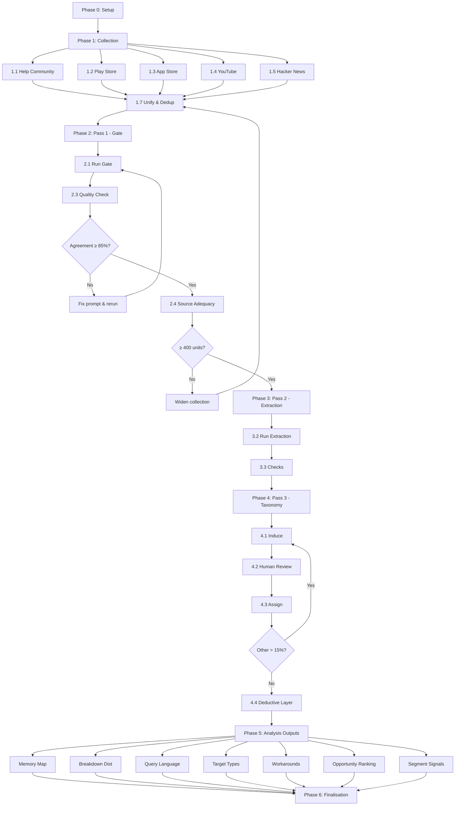

# Discovery Engine — Implementation Plan

> Derived from [`ProblemStatement.md`](file:///d:/Attempt%202/docs/ProblemStatement.md) and [`context.md`](file:///d:/Attempt%202/docs/context.md)
> Created: 2026-09-25
> Engine findings target: **29 September 2026** (4 days from now)
> Submission deadline: **7 October 2026, 15:59 IST**

---

## Timeline Overview

```
Sep 25 (today)  Setup + begin collection
Sep 26          Finish collection + Pass 1 + Checkpoint 1
Sep 27          Pass 2 + Pass 3 (taxonomy induction) + Checkpoint 2 & 3
Sep 28          Taxonomy assignment + analysis outputs
Sep 29          Final review, method notes, package findings
Oct 7           Submission deadline
```

> [!WARNING]
> There are only **4 working days** to reach the engine findings target on Sep 29. Every phase must run efficiently. Parallelise where possible (e.g. start Play Store scraping while Help Community crawl is running).

---

## Phase 0 — Project Setup

**Duration:** ~1 hour
**Goal:** Establish directory structure, dependencies, configuration, and method-notes skeleton.

### 0.1 Directory Structure

Create the full project scaffold:

```
d:\Attempt 2\
├── docs/
│   ├── ProblemStatement.md          # Already exists
│   ├── context.md                   # Already exists
│   ├── implementation-plan.md       # This file
│   └── method_notes.md              # Initialize skeleton now
├── data/
│   ├── raw/
│   │   ├── help_community/          # Raw HTML/JSON per thread
│   │   ├── playstore/               # Raw review data
│   │   ├── appstore/                # Raw review data (may be empty)
│   │   ├── youtube/                 # Raw comment data + video list
│   │   ├── hn/                      # Raw comment data
│   │   └── xda/                     # Raw forum data (if time permits)
│   ├── unified/                     # All sources merged into unit schema
│   ├── pass1/                       # Relevance-gated units
│   ├── pass2/                       # Extracted units (open extraction output)
│   ├── pass3/                       # Taxonomy-assigned units
│   └── out/                         # Final analysis CSVs + summary.json
├── prompts/
│   ├── pass1_relevance_gate.md      # Gate prompt, versioned
│   ├── pass2_extraction.md          # Extraction prompt, versioned
│   ├── pass3_induction.md           # Taxonomy induction prompt, versioned
│   ├── pass3_assignment.md          # Taxonomy assignment prompt, versioned
│   └── pass3_deductive_layer.md     # Four-stage failure mapping prompt
├── scripts/
│   ├── collectors/                  # One collector per source
│   │   ├── help_community.py
│   │   ├── playstore.py
│   │   ├── appstore.py
│   │   ├── youtube.py
│   │   ├── hn.py
│   │   └── xda.py
│   ├── unify.py                     # Merge all raw → unit schema
│   ├── dedup.py                     # Deduplicate on normalised text
│   ├── pass1_gate.py                # Relevance gate runner
│   ├── pass1_quality_check.py       # 60-unit sampling + human label sheet
│   ├── pass2_extract.py             # Open extraction runner
│   ├── pass2_checks.py              # Quote check, loss check, confidence floor
│   ├── pass3_induce.py              # Taxonomy induction (two shuffled runs + merge)
│   ├── pass3_assign.py              # Taxonomy assignment
│   ├── pass3_deductive.py           # Four-stage failure mapping
│   ├── analysis/                    # One script per analysis output
│   │   ├── memory_map.py            # 6.1
│   │   ├── breakdown_dist.py        # 6.2
│   │   ├── query_language.py        # 6.3
│   │   ├── target_types.py          # 6.4
│   │   ├── workarounds.py           # 6.5
│   │   ├── opportunity_ranking.py   # 6.6
│   │   └── segment_signals.py       # 6.7
│   └── utils/
│       ├── hashing.py               # Stable ID generation + author hashing
│       ├── lang_detect.py           # Language detection
│       ├── rate_limiter.py          # Shared rate-limiter (~1 req/sec)
│       └── logging.py               # Stage-level count logging
├── config/
│   ├── keywords.json                # Collection keywords from §1.2
│   ├── models.json                  # Model strings, confirmed before run
│   └── sources.json                 # Source metadata + robots.txt compliance notes
├── taxonomy_proposed.json           # Output of Pass 3.1
├── taxonomy_final.json              # Human-reviewed taxonomy
├── taxonomy_changes.md              # Record of human edits
├── requirements.txt                 # Python dependencies
└── .env.example                     # API key placeholders (YouTube, Anthropic)
```

### 0.2 Dependencies

```
# requirements.txt
anthropic                  # Claude API (Haiku 4.5 + Sonnet 5)
google-play-scraper        # Play Store reviews
google-api-python-client   # YouTube Data API v3
requests                   # HTTP for Help Community, HN, App Store RSS
beautifulsoup4             # HTML parsing for Help Community + XDA
lxml                       # Fast HTML parser
feedparser                 # RSS parsing for App Store
langdetect                 # Language detection
hashlib                    # (stdlib) Hashing
pandas                     # Data manipulation + CSV output
tqdm                       # Progress bars
python-dotenv              # Environment variable loading
```

### 0.3 Configuration Files

**`config/keywords.json`**
```json
{
  "collection_keywords": [
    "can't find", "cannot find", "couldn't find", "unable to find",
    "looking for", "search for", "remember", "forgot", "don't remember",
    "lost photo", "old photo", "that photo", "a photo of",
    "find a picture", "where is", "years ago", "scroll", "scrolling",
    "search doesn't", "search didn't", "search is useless",
    "search results", "no results", "nothing comes up",
    "face", "people", "location", "date", "album", "screenshot"
  ],
  "help_community_categories": [
    "search", "organisation", "albums", "finding photos"
  ]
}
```

**`config/models.json`** — confirm actual model strings before first run:
```json
{
  "pass1_gate": {
    "model": "claude-haiku-4-5-20250901",
    "temperature": 0,
    "confirmed": false,
    "confirmed_date": null
  },
  "pass2_extraction": {
    "model": "claude-sonnet-5-20250901",
    "temperature": 0,
    "confirmed": false,
    "confirmed_date": null
  },
  "pass3_induction": {
    "model": "claude-sonnet-5-20250901",
    "temperature": 0,
    "confirmed": false,
    "confirmed_date": null
  }
}
```

### 0.4 Initialize Method Notes

Create `docs/method_notes.md` with the required skeleton (to be filled as-you-go):

```markdown
# Method Notes

## Sources Attempted
| Source | Status | Units collected | Notes |
|---|---|---|---|
| Google Photos Help Community | pending | — | — |
| Google Play Store | pending | — | — |
| Apple App Store | pending | — | Last attempt returned nothing |
| YouTube | pending | — | — |
| Hacker News | pending | — | — |
| XDA Developers | pending | — | Supplementary |
| Reddit | **excluded** | 0 | API access not granted within the project timeline; scraping would breach its terms, so it was excluded rather than worked around |

## Models Used
| Pass | Model | Temperature | Run date | Confirmed |
|---|---|---|---|---|

## Pipeline Counts
| Stage | Units in | Units out | Lost | Notes |
|---|---|---|---|---|

## Gate Agreement
- Sample size: 60 (20 per label)
- Agreement rate: pending
- Prompt changes: none yet

## Confidence Floor
- Value: 0.6
- Adjusted by checkpoint 1.4: no (pending)

## Taxonomy Changes
- See `taxonomy_changes.md`
```

### 0.5 Pre-flight Checklist

- [ ] Confirm Claude Haiku 4.5 model string (`claude-haiku-4-5-*`) via Anthropic API
- [ ] Confirm Claude Sonnet 5 model string (`claude-sonnet-5-*`) via Anthropic API
- [ ] Obtain YouTube Data API v3 key
- [ ] Set up `.env` with `ANTHROPIC_API_KEY` and `YOUTUBE_API_KEY`
- [ ] Verify `robots.txt` for `support.google.com/photos/`
- [ ] Install all dependencies: `pip install -r requirements.txt`
- [ ] Run a smoke test: one Anthropic API call to confirm key works

---

## Phase 1 — Data Collection

**Duration:** ~6–10 hours (some collectors can run in parallel)
**Goal:** Collect raw data from all sources, unify into the unit schema, deduplicate, filter to English.

### 1.1 Google Photos Help Community (PRIMARY — highest effort)

**Script:** `scripts/collectors/help_community.py`

**Implementation steps:**

1. **Fetch robots.txt** from `https://support.google.com/robots.txt` — parse and respect disallowed paths
2. **Two collection strategies** (use both):
   - **Keyword search:** For each keyword in `keywords.json`, hit the search endpoint at `support.google.com/photos/search?q={keyword}` and collect thread URLs from result pages. Paginate through all available results.
   - **Category walk:** Navigate the thread listing pages for the categories: search, organisation, albums, finding photos. Paginate through all threads.
3. **Deduplicate thread URLs** across both strategies
4. **For each thread:**
   - Fetch the thread page
   - Parse the original question (OP): title, body, author, date
   - Parse **all replies**: body, author, date, reply ordering
   - Store OP as one unit; each reply as a separate unit with `parent_id` set to the OP's `source_id` and `is_reply = true`
   - Set `context` to the thread title for all units in the thread
5. **Rate limit:** 1 request/sec with a descriptive User-Agent header (e.g., `DiscoveryEngine/1.0 (academic research)`)
6. **Save:** Raw HTML + parsed JSON per thread in `data/raw/help_community/`

**Expected yield:** This is the primary depth source — aim for hundreds of threads with replies.

**Logging:** Record total threads fetched, total units (OPs + replies), any HTTP errors.

### 1.2 Google Play Store

**Script:** `scripts/collectors/playstore.py`

**Implementation steps:**

1. Use `google-play-scraper` library
2. **Two pulls:**
   - `sort=Sort.NEWEST`, `count=10000` — newest reviews
   - `sort=Sort.MOST_RELEVANT`, `count=10000` — most relevant reviews
3. Deduplicate across both pulls on `reviewId`
4. Map each review to unit schema:
   - `source = "playstore"`, `source_type = "review"`
   - `source_id = reviewId`
   - `text = review content`
   - `rating = score` (1–5 stars)
   - `created_at = at` (ISO format)
   - `is_reply = false`, `parent_id = null`
   - `context = null`
5. **Save:** JSON in `data/raw/playstore/`

**Expected yield:** ~10,000–15,000 raw reviews (before relevance filtering).

### 1.3 Apple App Store

**Script:** `scripts/collectors/appstore.py`

**Implementation steps:**

1. Construct RSS feed URLs for Google Photos app across storefronts: `in`, `us`, `gb` (minimum)
   - Format: `https://itunes.apple.com/{storefront}/rss/customerreviews/id=962194608/sortBy=mostRecent/json`
2. Paginate through available pages (RSS feeds typically have limited depth)
3. Parse using `feedparser`
4. Map to unit schema:
   - `source = "appstore"`, `source_type = "review"`
   - `rating = im:rating`
   - `is_reply = false`
5. **If it fails** (as in Attempt 1): log the failure clearly, record HTTP status codes, and move on. Do not block the pipeline.
6. **Save:** JSON in `data/raw/appstore/`

**Expected yield:** Unknown — may return nothing again. Report outcome either way.

### 1.4 YouTube Comments

**Script:** `scripts/collectors/youtube.py`

**Implementation steps:**

1. **Video selection:**
   - Search YouTube for queries like: `"Google Photos search tips"`, `"find old photos Google Photos"`, `"Google Photos organization"`, `"can't find photo Google Photos"`
   - Select **25–40 videos** that are relevant
   - **Store the video list** (`video_id`, `title`, `search_query_used`) in `data/raw/youtube/video_list.json`
2. **Comment collection** using YouTube Data API v3, `commentThreads.list`:
   - For each video: fetch all top-level comments and replies
   - Paginate using `nextPageToken`
   - Respect API quota (10,000 units/day default; each `commentThreads.list` costs ~1 unit)
3. Map to unit schema:
   - `source = "youtube"`, `source_type = "discussion"`
   - `context = video title`
   - For replies: `is_reply = true`, `parent_id = parent comment ID`
4. **Save:** JSON in `data/raw/youtube/`

**Expected yield:** Several hundred to low thousands of comments across 25–40 videos.

### 1.5 Hacker News

**Script:** `scripts/collectors/hn.py`

**Implementation steps:**

1. Use the **Algolia HN Search API** (public, free, no auth): `https://hn.algolia.com/api/v1/search`
2. Search queries:
   - `"Google Photos" search`
   - `"Google Photos" find photo`
   - `"Google Photos" old photo`
   - `photo retrieval`
   - `find old photos`
3. For each matching story or comment:
   - Fetch the full item via `https://hn.algolia.com/api/v1/items/{id}` to get the comment tree
   - Collect all child comments in the thread
4. Map to unit schema:
   - `source = "hn"`, `source_type = "discussion"`
   - `context = story title`
5. **Save:** JSON in `data/raw/hn/`

**Expected yield:** Low volume (tens to low hundreds), but high quality.

### 1.6 XDA Developers (Supplementary)

**Script:** `scripts/collectors/xda.py`

**Implementation steps:**

1. **Only run after sources 1.1–1.5 are complete**
2. Search XDA forums for Google Photos threads
3. Parse forum thread pages with BeautifulSoup
4. Collect OP + replies
5. Map to unit schema
6. **Save:** JSON in `data/raw/xda/`

**Expected yield:** Small. Only pursue if the adequacy checkpoint looks borderline.

### 1.7 Unification & Deduplication

**Script:** `scripts/unify.py` + `scripts/dedup.py`

**Implementation steps:**

1. **Load** all per-source JSON files from `data/raw/*/`
2. **Normalize** each into the unit schema (§4 of context.md):
   - Generate `id` as `sha256(source + source_id)`
   - Hash author identifiers: `author_hash = sha256(source + raw_author_name)`
   - Detect language using `langdetect`
3. **Filter:** Keep English only (`lang == "en"`). Record count of non-English units set aside.
4. **Deduplicate:** Normalize text (lowercase, strip whitespace, remove punctuation) and deduplicate on normalized text. Record count of duplicates removed.
5. **Save:** `data/unified/units.jsonl` (one JSON object per line)
6. **Report:**

```
Source counts:
  help_community: X units (Y threads, Z replies)
  playstore: X units
  appstore: X units (or: failed — see method notes)
  youtube: X units (across N videos)
  hn: X units
  xda: X units (or: not attempted)
Total raw: X
After language filter: X (Y non-English removed)
After dedup: X (Y duplicates removed)
Final unified units: X
```

Write this report to `docs/method_notes.md` under "Pipeline Counts".

---

## Phase 2 — Pass 1: Relevance Gate

**Duration:** ~2–4 hours (API calls + quality check)
**Goal:** Classify every unit as `yes`, `partial`, or `no`. Filter to relevant units.

### 2.1 Write the Gate Prompt

**File:** `prompts/pass1_relevance_gate.md`

```markdown
# System Prompt
You are a classifier. Your task is to determine whether a piece of user feedback
is about someone trying to find a specific photo or video they believe already
exists in their Google Photos library.

# Rules
- "yes" — The person is looking for, or describes trying to find, a specific
  existing photo or video.
- "partial" — Search or retrieval is discussed in general terms, but there is
  no specific target photo (e.g., "search is bad", "search never works").
  Keep these — they will be analysed separately.
- "no" — The text is about backup, storage, sync, pricing, editing, sharing,
  deleted photos, app crashes, or anything else not about finding/retrieving
  a specific photo.

# Special rule for replies
If this text is a reply to a relevant parent post, and this reply describes
how to find something (e.g., suggests a workaround, a search tip, or a
method), classify it as "yes" — even if it does not restate the target photo.

# Output format (JSON only, no other text)
{
  "relevant": "yes | partial | no",
  "reason": "one short sentence explaining the classification"
}
```

### 2.2 Run the Gate

**Script:** `scripts/pass1_gate.py`

**Implementation steps:**

1. Load all units from `data/unified/units.jsonl`
2. For each unit, call Claude Haiku 4.5 at temperature 0:
   - If `is_reply == true`, include the parent unit's text as context
   - User message: the unit's `text` (plus parent text if reply)
   - System message: the gate prompt
3. Parse JSON response → extract `relevant` and `reason`
4. Save results to `data/pass1/gated_units.jsonl` with the gate decision appended to each unit
5. **Log counts:**
   - Total units sent: X
   - `yes`: X
   - `partial`: X
   - `no`: X
   - Errors (API failures, unparseable responses): X
6. Filter to `yes` + `partial` → save as `data/pass1/relevant_units.jsonl`
7. Record model string, run date, and counts in `config/models.json` and `docs/method_notes.md`

### 2.3 Quality Check on the Gate

**Script:** `scripts/pass1_quality_check.py`

**Implementation steps:**

1. From the gated results, randomly sample:
   - 20 units labelled `yes`
   - 20 units labelled `partial`
   - 20 units labelled `no`
2. Export these 60 units to `data/pass1/quality_check_sample.csv`:
   - Columns: `id`, `text`, `context`, `model_label`, `human_label` (blank)
   - **Shuffle** so the human doesn't see the model's label while reviewing
3. **⏸️ HARD STOP — Human reviews these 60 units:**
   - Label each unit blind (without seeing `model_label`)
   - Fill in `human_label` column
4. Compute agreement rate:
   - `agreement = count(model_label == human_label) / 60`
5. **Decision:**
   - **≥ 85% agreement** → proceed to source adequacy checkpoint
   - **< 85% agreement** → fix the prompt, re-run Pass 1, repeat quality check
6. Record agreement rate in `docs/method_notes.md`

### 2.4 Source Adequacy Checkpoint

> [!IMPORTANT]
> **⏸️ HARD STOP #1** — Do not proceed to Pass 2 until this is cleared.

**Report the relevant-unit count by source:**

```
Relevant units (yes + partial) by source:
  help_community: X (discussion)
  playstore: X (review)
  appstore: X (review)
  youtube: X (discussion)
  hn: X (discussion)
  xda: X (discussion)
  
Total relevant: X
  Of which discussion-type: X
  Of which review-type: X
```

**Decision tree:**

| Condition | Action |
|---|---|
| ≥ 400 relevant AND ≥ 80 discussion-type | ✅ **Proceed** to Pass 2 |
| Below threshold | ⚠️ **Widen** collection: more Help Community categories, more YouTube videos, additional App Store storefronts, then XDA. Re-run Pass 1 on new units. Re-check. |
| Still short after widening | 🔻 **Report explicitly** in findings and deck. Lower confidence floor to 0.5 (state the change). Proceed with what we have — lean on primary research in Part 3 for depth. |

---

## Phase 3 — Pass 2: Open Extraction

**Duration:** ~3–5 hours (API calls + programmatic checks)
**Goal:** Extract structured memory/retrieval data from every relevant unit in free text.

### 3.1 Write the Extraction Prompt

**File:** `prompts/pass2_extraction.md`

```markdown
# System Prompt
You are extracting structured information from user feedback about trying to
find a specific photo or video in Google Photos. Extract only what the text
explicitly states. Never infer something the user didn't say.

# Rules
- "remembered" and "forgotten" are the most important fields. Split them into
  separate items. Do not merge "the beach and my sister" into one item — those
  are two separate remembered cues: "the beach" and "my sister".
- "query_text" must be the user's exact words if they quoted a search, or null.
- "evidence_quote" must be copied character-for-character from the source text.
  Do not paraphrase, correct spelling, or alter it in any way.
- If something is not stated in the text, return null or an empty list.
- For "outcome": use "found" only if the user explicitly says they found it.
  Use "gave_up" if they express giving up. Use "not_found" if still searching.
  Use "unclear" if the outcome is ambiguous.

# Output format (JSON only, no other text)
{
  "target": "string or null",
  "remembered": ["string", ...],
  "forgotten": ["string", ...],
  "attempts": [
    {
      "action": "string",
      "query_text": "string or null"
    }
  ],
  "breakdown": "string or null",
  "outcome": "found | not_found | gave_up | unclear",
  "workaround": "string or null",
  "stakes": "string or null",
  "context_signals": {
    "library_size_hint": "string or null",
    "time_since_photo": "string or null",
    "device": "string or null",
    "use_case": "string or null"
  },
  "evidence_quote": "string",
  "confidence": 0.0
}
```

### 3.2 Run the Extraction

**Script:** `scripts/pass2_extract.py`

**Implementation steps:**

1. Load all relevant units from `data/pass1/relevant_units.jsonl`
2. For each unit, call Claude Sonnet 5 at temperature 0:
   - If `is_reply == true`, prepend the parent unit's text as context with a clear separator:
     ```
     [PARENT POST]
     {parent_text}
     
     [REPLY — extract from this text only]
     {reply_text}
     ```
   - System message: the extraction prompt
3. Parse JSON response
4. Append extraction results to each unit → save to `data/pass2/extracted_units.jsonl`
5. **Log:** model string, run date, units in, units out

### 3.3 Programmatic Checks

**Script:** `scripts/pass2_checks.py`

**Three mandatory checks:**

#### Check 1 — Quote Verification
```python
for unit in extracted_units:
    if unit["evidence_quote"] not in unit["text"]:
        unit["quote_valid"] = False
        failed_quotes.append(unit["id"])
    else:
        unit["quote_valid"] = True
```
- Report: `X of Y evidence quotes are valid substring matches`
- Flag invalid quotes — exclude from quote displays but keep the unit

#### Check 2 — Loss Check
```python
units_sent = count(relevant_units)
units_returned = count(extracted_units)
lost = units_sent - units_returned
```
- Report: `Sent: X, Returned: Y, Lost: Z`
- If any lost: investigate (batch API timeout? malformed response?) and log in method notes

#### Check 3 — Confidence Floor
```python
confidence_floor = 0.6  # or 0.5 if checkpoint 1.4 forced it lower

above_floor = [u for u in extracted_units if u["confidence"] >= confidence_floor]
below_floor = [u for u in extracted_units if u["confidence"] < confidence_floor]
```
- Report: `Above floor (≥ {confidence_floor}): X units. Below floor: Y units.`
- Keep only above-floor units for main analysis
- Save both sets separately:
  - `data/pass2/extracted_above_floor.jsonl` (main analysis set)
  - `data/pass2/extracted_below_floor.jsonl` (excluded, kept for reference)

### 3.4 Per-Stage Report

Output after Pass 2:

```
=== Pass 2 Report ===
Model: claude-sonnet-5-{version}
Temperature: 0
Run date: YYYY-MM-DD

Units in: X (relevant from Pass 1)
Units out: Y
Lost to API errors: Z

Quote check: A/B valid (C% pass rate)
Confidence ≥ 0.6: D units (main analysis set)
Confidence < 0.6: E units (excluded)

--- 5 Random Samples ---
[display 5 randomly selected extracted units for sanity check]
```

---

## Phase 4 — Pass 3: Taxonomy Induction

**Duration:** ~4–6 hours (induction + human review + assignment)
**Goal:** Derive categories from the data, get human approval, assign all units.

### 4.1 Taxonomy Induction (Step 3.1)

**Script:** `scripts/pass3_induce.py`

**Run separately for each of these 5 fields:**
- `target`
- `remembered`
- `forgotten`
- `breakdown`
- `workaround`

**For each field:**

1. **Collect** all non-null phrases for that field across all above-floor units
   - For array fields (`remembered`, `forgotten`): flatten so each individual phrase is a separate entry
2. **Shuffle Run A:**
   - Take a random sample of 300–400 phrases (or all, if fewer)
   - Send to Claude Sonnet 5 at temperature 0 with the induction prompt:
   
   ```markdown
   # System Prompt
   You are analysing a collection of short phrases extracted from user feedback
   about photo retrieval in Google Photos.
   
   Below are {N} phrases from the "{field_name}" field.
   
   Propose 8–15 categories that naturally group these phrases. For each category:
   - Name: a short descriptive label
   - Definition: one sentence explaining what belongs in this category
   - Examples: exactly 3 real phrases from the list below that belong to it
   
   Do not force phrases into categories. If a phrase doesn't fit any category,
   note it. Aim for categories that are mutually exclusive and collectively
   exhaustive of the major themes.
   
   # Output format (JSON)
   {
     "field": "{field_name}",
     "categories": [
       {
         "name": "string",
         "definition": "string",
         "examples": ["string", "string", "string"]
       }
     ],
     "uncategorised_phrases": ["string", ...]
   }
   ```

3. **Shuffle Run B:**
   - Take a *different* random sample of 300–400 phrases
   - Same prompt, same model, same temperature
   
4. **Merge:**
   - Categories appearing in both runs (by name similarity or overlapping examples) → **stable** ✅
   - Categories appearing in only one run → **flagged** ⚠️
   - Save merge results with stability annotations

5. **Aggregate** across all 5 fields into `taxonomy_proposed.json`:

```json
{
  "generated_date": "YYYY-MM-DD",
  "model": "claude-sonnet-5-{version}",
  "fields": {
    "target": {
      "categories": [
        {
          "name": "...",
          "definition": "...",
          "examples": ["...", "...", "..."],
          "stability": "stable | flagged"
        }
      ]
    },
    "remembered": { ... },
    "forgotten": { ... },
    "breakdown": { ... },
    "workaround": { ... }
  }
}
```

### 4.2 Human Review (Step 3.2)

> [!IMPORTANT]
> **⏸️ HARD STOP #3** — Do not assign categories until a human has reviewed `taxonomy_proposed.json`.

**Human reviewer actions:**
- Review each field's proposed categories
- Pay special attention to **flagged** (unstable) categories — decide: keep, merge, rename, or drop
- Merge near-duplicate categories
- Split categories that are too broad
- Rename for clarity
- Save result as `taxonomy_final.json` (same structure, without `stability` field)
- Document all changes in `taxonomy_changes.md`:

```markdown
# Taxonomy Changes

## Changes from proposed → final

### target
- Merged "travel photos" and "vacation photos" → "travel & vacation"
- Renamed "docs" → "documents & screenshots"
- ...

### remembered
- Split "location" into "specific place" and "geographic region"
- Dropped "misc" (too vague, examples redistributed)
- ...

[repeat for each field]

## Rationale
[short paragraph on overall approach to the review]
```

### 4.3 Taxonomy Assignment (Step 3.3)

**Script:** `scripts/pass3_assign.py`

**Implementation steps:**

1. Load `taxonomy_final.json`
2. For each unit in `data/pass2/extracted_above_floor.jsonl`:
   - For each of the 5 fields (`target`, `remembered`, `forgotten`, `breakdown`, `workaround`):
     - Send the phrase(s) + the list of categories for that field to Claude Sonnet 5 at temperature 0
     - Ask the model to assign each phrase to exactly one category, or `other`
   - Prompt:
   
   ```markdown
   Assign the following phrase to exactly one of the categories below, or "other"
   if it genuinely does not fit any. Return only the category name.
   
   Categories for "{field_name}":
   {list of categories with definitions from taxonomy_final.json}
   
   Phrase: "{phrase}"
   
   Output (JSON): { "category": "string" }
   ```

3. Append category assignments to each unit → save to `data/pass3/assigned_units.jsonl`

4. **Other-rate check:**
   ```
   For each field:
     other_count = count of phrases assigned to "other"
     total_count = total phrases for that field
     other_rate = other_count / total_count
     
     If other_rate > 0.15:
       → Taxonomy is incomplete for this field
       → Collect the "other" phrases
       → Return to Step 4.1 (induction) with just these phrases
       → Propose additional categories
       → Human reviews additions
       → Re-assign
   ```

5. **Report:**
   ```
   Assignment results by field:
     target: X phrases assigned, Y other (Z%)
     remembered: X phrases, Y other (Z%)
     forgotten: X phrases, Y other (Z%)
     breakdown: X phrases, Y other (Z%)
     workaround: X phrases, Y other (Z%)
   ```

### 4.4 Deductive Layer (Step 3.4)

**Script:** `scripts/pass3_deductive.py`

**Implementation steps:**

1. For each unit's `breakdown` text, classify it into one of four failure stages:
   - **Express** — user can't articulate what they remember
   - **Understand** — product doesn't interpret the clues correctly
   - **Evaluate** — results are hard to scan/recognise
   - **Refine** — user can't narrow down after an initial failed search
   - **Other** — fits none of the four (these are the interesting ones)

2. Prompt:
   ```markdown
   A user's photo retrieval attempt broke down as follows:
   "{breakdown_text}"
   
   Classify this breakdown into exactly one of these failure stages:
   - "express": The user couldn't articulate or translate what they remembered into a search
   - "understand": The product failed to interpret or match the clues the user provided
   - "evaluate": The results were returned but were hard to scan, recognise, or verify
   - "refine": The user couldn't narrow down or adjust after an initial unsuccessful attempt
   - "other": Does not fit any of the above four stages
   
   Output (JSON): { "failure_stage": "express | understand | evaluate | refine | other" }
   ```

3. Append `failure_stage` to each unit → save updated `data/pass3/assigned_units.jsonl`
4. **Report:** count per stage + `other` count
5. **Flag:** `other` cases are potentially the most valuable — they represent failures outside the brief's own frame

---

## Phase 5 — Analysis Outputs

**Duration:** ~3–4 hours
**Goal:** Generate all 7 analysis outputs as CSVs + `summary.json`.

### 5.1 Memory Map (Output 6.1) — HEADLINE

**Script:** `scripts/analysis/memory_map.py`

```python
# Pseudocode
for each cue_category in taxonomy_final["remembered"]["categories"] + taxonomy_final["forgotten"]["categories"]:
    remembered_count = count of units where cue_category appears in remembered
    forgotten_count = count of units where cue_category appears in forgotten
    net = remembered_count - forgotten_count
    
# Output: data/out/memory_map.csv
# Columns: cue_category, remembered_in, forgotten_in, net
# Sort by: net descending (most reliably remembered first)
```

### 5.2 Breakdown Distribution (Output 6.2)

**Script:** `scripts/analysis/breakdown_dist.py`

Two sub-tables:
1. **Inductive:** Units per `breakdown` category (from taxonomy assignment)
2. **Deductive:** Units per failure stage (`express`, `understand`, `evaluate`, `refine`, `other`)

Output: `data/out/breakdown_distribution.csv`

### 5.3 Query Language (Output 6.3)

**Script:** `scripts/analysis/query_language.py`

```python
for each unit with non-null attempts:
    for each attempt with non-null query_text:
        word_count = len(query_text.split())
        entity_type = classify(query_text)  # object, place, person, time, feeling
        is_reformulation = (attempt_index > 0)
        
# Output: data/out/query_language.csv
# Columns: unit_id, query_text, word_count, entity_types, is_first_attempt
```

### 5.4 Target Types (Output 6.4)

**Script:** `scripts/analysis/target_types.py`

```python
# Count units per target category from taxonomy assignment
for each target_category in taxonomy_final["target"]["categories"]:
    count = units assigned to this category
    
# Output: data/out/target_types.csv
# Columns: target_category, unit_count, percentage
```

### 5.5 Workarounds (Output 6.5)

**Script:** `scripts/analysis/workarounds.py`

```python
for each unit with non-null workaround:
    workaround_category = assigned category
    origin = "self" if unit.is_reply == false else "other"  
    # self = person with the problem
    # other = someone replying to them (advice/recommendation)
    
# Output: data/out/workarounds.csv
# Columns: workaround_category, origin, unit_count, example_quotes
```

> [!NOTE]
> The split by origin is critical. A workaround invented by the searcher themselves is different evidence from one recommended by a stranger in a forum reply.

### 5.6 Opportunity Ranking (Output 6.6)

**Script:** `scripts/analysis/opportunity_ranking.py`

```python
for each breakdown_category:
    frequency = unit_count
    
    # Mean severity: based on outcome + stakes
    severity_scores = []
    for unit in category_units:
        if unit.outcome in ["gave_up", "not_found"] and unit.stakes is not None:
            severity_scores.append(1.0)  # highest
        elif unit.outcome in ["gave_up", "not_found"]:
            severity_scores.append(0.7)
        elif unit.outcome == "unclear":
            severity_scores.append(0.4)
        else:
            severity_scores.append(0.2)
    mean_severity = mean(severity_scores)
    
    # Specificity: share with concrete target
    specificity = count(unit.target is not None and unit.gate_label == "yes") / frequency
    
    # Triangulation (weighted by source TYPE)
    source_types_present = set(unit.source_type for unit in category_units)
    sources_present = set(unit.source for unit in category_units)
    
    if len(source_types_present) >= 2:        # both review & discussion
        triangulation = 1.0
    elif len(sources_present) >= 2:            # 2+ sources, same type
        triangulation = 0.85
    else:                                       # single source
        triangulation = 0.7
    
    opportunity = frequency * mean_severity * specificity * triangulation

# Output: data/out/opportunity_ranking.csv
# Columns: breakdown_category, frequency, mean_severity, specificity,
#           triangulation, triangulation_condition, opportunity_score
# Also save: formula, weights, source-type mapping (all visible on dashboard)
```

### 5.7 Segment Signals (Output 6.7)

**Script:** `scripts/analysis/segment_signals.py`

**Segmentation dimensions:**
- `library_size_hint` (from `context_signals`)
- `time_since_photo` (from `context_signals`)
- `use_case` (from `context_signals`)

```python
for each dimension:
    coverage = count(units with non-null value) / total_units
    
    if coverage is too low (< 10% or < 30 units):
        report: "Insufficient coverage for {dimension} — X units (Y%)"
        do NOT show analysis for this dimension
    else:
        bucket units by dimension value
        for each bucket:
            show: key findings (top breakdown categories, top memory cues)
            show: bucket size

# Output: data/out/segment_signals.csv
# Columns: dimension, bucket, unit_count, coverage_pct, top_breakdowns, notes
```

### 5.8 Summary JSON

**File:** `data/out/summary.json`

```json
{
  "generated_date": "YYYY-MM-DD",
  "pipeline": {
    "total_collected": 0,
    "after_language_filter": 0,
    "after_dedup": 0,
    "unified_units": 0,
    "pass1_yes": 0,
    "pass1_partial": 0,
    "pass1_no": 0,
    "pass1_errors": 0,
    "pass2_extracted": 0,
    "pass2_lost": 0,
    "pass2_quote_failures": 0,
    "pass2_above_confidence_floor": 0,
    "pass2_below_confidence_floor": 0,
    "confidence_floor": 0.6,
    "pass3_other_rates": {
      "target": 0.0,
      "remembered": 0.0,
      "forgotten": 0.0,
      "breakdown": 0.0,
      "workaround": 0.0
    }
  },
  "gate_quality": {
    "sample_size": 60,
    "agreement_rate": 0.0
  },
  "source_counts": {
    "help_community": 0,
    "playstore": 0,
    "appstore": 0,
    "youtube": 0,
    "hn": 0,
    "xda": 0
  },
  "outputs": {
    "memory_map": "data/out/memory_map.csv",
    "breakdown_distribution": "data/out/breakdown_distribution.csv",
    "query_language": "data/out/query_language.csv",
    "target_types": "data/out/target_types.csv",
    "workarounds": "data/out/workarounds.csv",
    "opportunity_ranking": "data/out/opportunity_ranking.csv",
    "segment_signals": "data/out/segment_signals.csv"
  }
}
```

---

## Phase 6 — Finalisation

**Duration:** ~2–3 hours
**Goal:** Complete method notes, validate all outputs, package for review.

### 6.1 Complete Method Notes

Update `docs/method_notes.md` with all final numbers:

- [ ] Every source attempted + outcome (success/failure/partial)
- [ ] Reddit exclusion statement (verbatim)
- [ ] App Store outcome
- [ ] Model strings + temperatures + run dates
- [ ] Confidence floor + whether 1.4 forced it lower
- [ ] Units in/out at every stage (including batch API losses)
- [ ] Gate agreement rate
- [ ] Changes between `taxonomy_proposed.json` and `taxonomy_final.json`

### 6.2 Validation Checklist

Run these checks before declaring findings ready:

- [ ] **No invented data:** Every number in `summary.json` traces to stored units. Spot-check 10 random units end-to-end.
- [ ] **No preset taxonomy:** `taxonomy_proposed.json` exists, `taxonomy_changes.md` documents the human review, and `taxonomy_final.json` contains only categories traceable to the induction step.
- [ ] **Reproducible:** All output files have model strings, temperatures, and run dates. Re-running with the same inputs produces the same outputs (temperature 0).
- [ ] **Honest denominators:** Every stage's in/out counts are logged. Losses are reported.
- [ ] **Quote check:** All `evidence_quote` fields marked as valid are confirmed substrings.
- [ ] **Memory map makes sense:** Review the top 5 and bottom 5 rows — do they align with intuition from reading the raw data?
- [ ] **Opportunity ranking formula is saved** alongside the table with weights and source-type mapping.
- [ ] **Segment signals report coverage** — no claims made without sufficient data.

### 6.3 Generate 5 Random Samples per Stage

For the final report, ensure you have saved 5 randomly sampled units at each stage:
1. After collection (raw)
2. After Pass 1 (with gate labels)
3. After Pass 2 (with extraction)
4. After Pass 3 (with taxonomy + deductive layer)

These serve as sanity-check evidence for anyone reviewing the method.

---

## Risk Register

| Risk | Likelihood | Impact | Mitigation |
|---|---|---|---|
| App Store RSS returns nothing (again) | High | Low | Report and move on. Other sources compensate. |
| Help Community scraping blocked | Medium | High | Respect robots.txt + rate limit. If blocked, fall back to manual collection of key threads. |
| YouTube API quota exhausted | Medium | Medium | Plan video list carefully. Collect highest-priority videos first. Stay within 10K units/day. |
| < 400 relevant units | Medium | High | Follow widening protocol (§1.4). If still short, lower confidence floor and report. |
| Batch API drops units | Medium | Low | Loss check catches it. Re-request dropped units individually. |
| Gate agreement < 85% | Low | Medium | Iterate on prompt. Budget 1–2 extra prompt revision cycles. |
| Taxonomy `other` > 15% | Medium | Medium | Re-run induction on `other` phrases. Budget time for one iteration. |
| Tight timeline (4 days) | High | High | Parallelise collection. Start Play Store + HN + YouTube while Help Community runs. Cut XDA if tight. |

---

## Decision Log

Track all significant decisions made during execution:

| Date | Decision | Rationale | Impact |
|---|---|---|---|
| | | | |

---

## Dependency Graph



---

## Quick Reference — What to Run When

| Step | Script | Input | Output | Blocks on |
|---|---|---|---|---|
| Collect Help Community | `scripts/collectors/help_community.py` | keywords, categories | `data/raw/help_community/` | — |
| Collect Play Store | `scripts/collectors/playstore.py` | — | `data/raw/playstore/` | — |
| Collect App Store | `scripts/collectors/appstore.py` | — | `data/raw/appstore/` | — |
| Collect YouTube | `scripts/collectors/youtube.py` | API key | `data/raw/youtube/` | — |
| Collect HN | `scripts/collectors/hn.py` | — | `data/raw/hn/` | — |
| Collect XDA | `scripts/collectors/xda.py` | — | `data/raw/xda/` | Phases 1.1–1.5 |
| Unify + Dedup | `scripts/unify.py` + `scripts/dedup.py` | `data/raw/*/` | `data/unified/units.jsonl` | All collectors |
| Pass 1 Gate | `scripts/pass1_gate.py` | `data/unified/units.jsonl` | `data/pass1/` | Unify |
| Gate Quality | `scripts/pass1_quality_check.py` | `data/pass1/` | CSV sample | Pass 1 |
| **⏸️ Checkpoint 1** | Human | Counts by source | Go/no-go | Quality check |
| Pass 2 Extract | `scripts/pass2_extract.py` | `data/pass1/relevant_units.jsonl` | `data/pass2/` | Checkpoint 1 |
| Pass 2 Checks | `scripts/pass2_checks.py` | `data/pass2/` | Validated data | Pass 2 |
| Pass 3 Induce | `scripts/pass3_induce.py` | `data/pass2/` | `taxonomy_proposed.json` | Pass 2 Checks |
| **⏸️ Checkpoint 3** | Human | `taxonomy_proposed.json` | `taxonomy_final.json` | Induction |
| Pass 3 Assign | `scripts/pass3_assign.py` | `taxonomy_final.json` + data | `data/pass3/` | Checkpoint 3 |
| Deductive Layer | `scripts/pass3_deductive.py` | `data/pass3/` | Updated pass3 data | Assignment |
| Analysis Outputs | `scripts/analysis/*.py` | `data/pass3/` | `data/out/*.csv` | Deductive layer |
| Finalise | Manual | All outputs | Method notes + review | Analysis |
